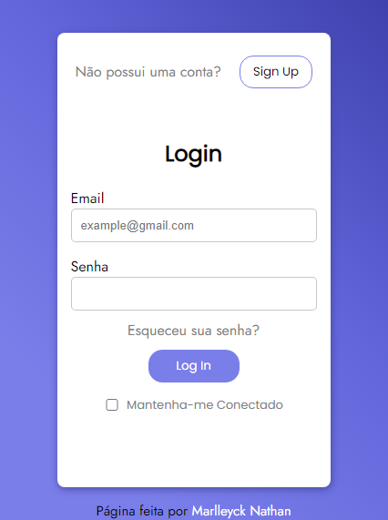
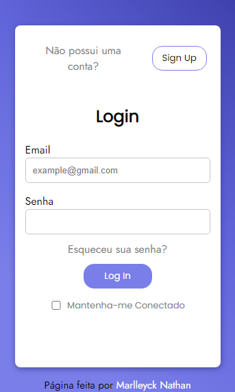

<h1 align="center">Primeira-Pagina-Login</h1>

 
Minha primeira página de login responsiva, apenas com HTML e CSS.

 
<a href="https://marlleyck.github.io/Primeira-Pagina-Login/" target="_blank">Acesse aqui</a>

 

